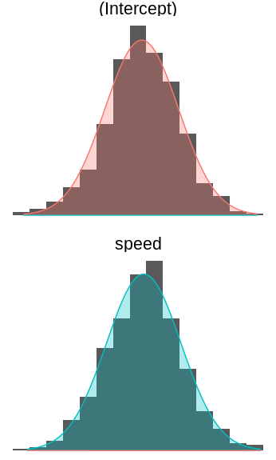
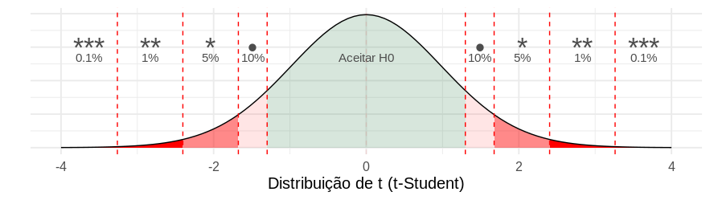
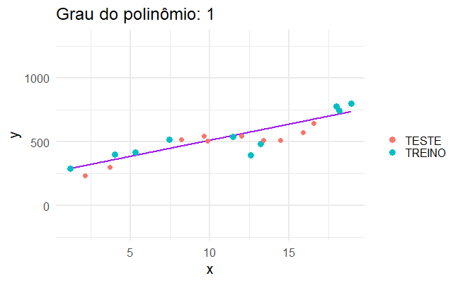
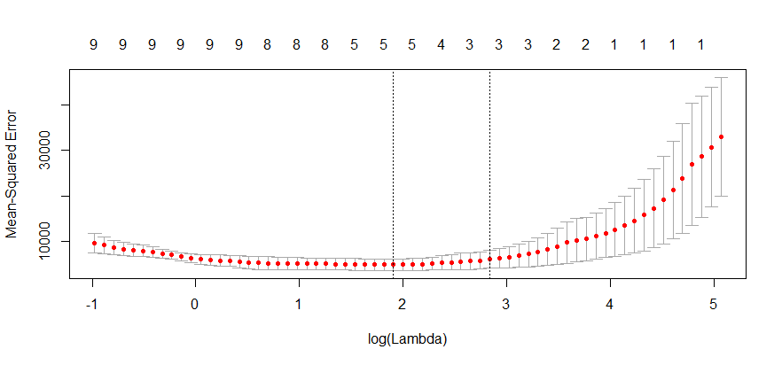

```{r setup, include=FALSE}
library(ggplot2)
library(magrittr)
library(knitr)
library(tidyverse)
library(ISLR)
library(kableExtra)
theme_set(theme_minimal(14))
options(htmltools.dir.version = FALSE)
```


# Agenda

.pull-left[
- O que é e quando usar
- Parâmetro vs estimador
- Teste de Hipóteses e valor-p
- Interpretação dos parâmetros
- Desempenho: EQM, EPR, AUC, Confusion Matrix
- Outliers
- Regressão Linear Múltipla
- Preditores Categóricos
- Transformações Não Lineares dos Preditores
- Interações
- Multicolinearidade
- Fazendo Predições
- Regressão Logística

]

.pull-right[

#### Tópicos para próximos passos

- Limitações da Regressão Linear
- Sobreajuste (overfitting)
- Regularização
- LASSO e Seleção de Preditores
- Validação Cruzada
- Frameworks de Machine Learning

]

---

# Ciência de dados


---

# Referências

.pull-left[
<a href = "https://static1.squarespace.com/static/5ff2adbe3fe4fe33db902812/t/6062a083acbfe82c7195b27d/1617076404560/ISLR%2BSeventh%2BPrinting.pdf">
</img>
</a>
]

.pull-right[
<a href = "https://web.stanford.edu/~hastie/Papers/ESLII.pdf">
</img>
</a>
]


---

# Referências

.pull-left[
<a href = "https://r4ds.had.co.nz/">
</img>
</a>
]

.pull-right[
<a href = "https://www.tmwr.org/">
</img>
</a>
]


---

## Referências

- [Aprendizagem de Máquinas: Uma Abordagem Estatística (Rafael Izbicki e Thiago Mendonça, 2020)](http://www.rizbicki.ufscar.br/AME.pdf)

- [Introduction to Statistical Learning (Hastie, et al)](https://hastie.su.domains/ISLR2/ISLRv2_website.pdf)

- [Ciência de Dados: Fundamentos e Aplicações](https://curso-r.github.io/main-regressao-linear/referencias/Ci%C3%AAncia%20de%20Dados.%20Fundamentos%20e%20Aplica%C3%A7%C3%B5es.%20Vers%C3%A3o%20parcial%20preliminar.%20maio%20Pedro%20A.%20Morettin%20Julio%20M.%20Singer.pdf)

---

class: middle, center, inverse

# Introdução

---

# Motivação

```{r echo=FALSE, include=FALSE}
knitr::opts_chunk$set(
  echo = FALSE, 
  message = FALSE, 
  warning = FALSE,
  fig.width=6, 
  fig.height=6,
  fig.align='center'
)
library(rpart)
adv <- read_csv("static/data/Advertising.csv") %>%
  rename(vendas = sales)
```

Somos consultores e fomos contratados para dar conselhos para uma empresa aumentar as suas vendas.

Obtivemos o seguinte banco de dados

```{r, fig.width = 10, fig.height = 4}
adv_ok <- adv %>% 
  gather(midia, investimento, -vendas)

adv_ok %>% 
  ggplot(aes(x = investimento, y = vendas)) + 
  geom_point() +
  facet_wrap(~midia, scales = "free")
```

* PERGUNTA: Jornal tem mais retorno do que as demais mídias? Quantas vendas terão se eu investir X em jornais? 

---

# Motivação


Somos consultores e fomos contratados para dar conselhos para uma empresa aumentar as suas vendas.

Obtivemos o seguinte banco de dados

```{r, fig.width = 10, fig.height = 4}
adv_ok %>% 
  ggplot(aes(x = investimento, y = vendas)) + 
  geom_point() +
  geom_smooth(se = FALSE, method = "lm") +
  facet_wrap(~midia, scales = "free")
```

* PERGUNTA: Jornal tem mais retorno do que as demais mídias? Quantas vendas terão se eu investir X em jornais? 


---

# Motivação - outro exemplo


Somos da área de inadimplência e precisamos agir para assessorar clientes em situação iminente de atraso.

Obtivemos o seguinte banco de dados

```{r, fig.width = 10, fig.height = 4}
set.seed(1)
inadimplencia <- tibble::tibble(
  tipo_de_contrato = rep(c("revol", "padrao", "price"), each = 1000),
  valor_da_parcela = round(runif(3000, min = 500, max = 3000), digits = 0),
  atrasou = rbinom(3000, 1, prob = 1/(1 + exp(-1*(
    -9 + 
      1.5 * (tipo_de_contrato == "revol") + 
      -1.5 * (tipo_de_contrato == "padrao") + 
      0.005 * (valor_da_parcela) + 
      1 * (valor_da_parcela > 1500)
    ))))
)

inad_curva <- inadimplencia %>% 
  ggplot(aes(x = valor_da_parcela, y = atrasou))  +
  facet_wrap(~tipo_de_contrato, scales = "free") +
  xlim(c(400, 3100))

inad_curva + 
  geom_point()
```

* PERGUNTA: Qual tipo de contrato é o que me traz mais risco?

---

# Motivação - outro exemplo


Somos da área de inadimplência e precisamos agir para assessorar clientes em situação iminente de atraso.

Obtivemos o seguinte banco de dados

```{r, fig.width = 10, fig.height = 4}
inad_curva + 
  geom_point() +
  geom_smooth(se = FALSE, method = "glm", method.args = list(family = "binomial"))
```

* PERGUNTA: Qual tipo de contrato é o que me traz mais risco?

---

# Motivação - outro exemplo


Somos da área de inadimplência e precisamos agir para assessorar clientes em situação iminente de atraso.

Obtivemos o seguinte banco de dados

```{r, fig.width = 10, fig.height = 4}
inad_curva +
  stat_summary_bin(size = 1, alpha = 0.1, colour = "white", bins = 7, geom = "bar", fill = "royalblue", fun = function(x) 1) +
  stat_summary_bin(size = 1, alpha = 0.1, colour = "white", bins = 7, geom = "bar", fill = "red") +
  stat_summary_bin(size = 2, alpha = 1, colour = "purple", bins = 7, geom = "point") + 
  geom_point() +
  geom_smooth(se = FALSE, method = "glm", method.args = list(family = "binomial"))
```

* PERGUNTA: Qual tipo de contrato é o que me traz mais risco?

---

# Motivação - outro exemplo


Somos da área de inadimplência e precisamos agir para assessorar clientes em situação iminente de atraso.

Obtivemos o seguinte banco de dados

```{r, fig.width = 10, fig.height = 4}
inad_curva +
  stat_summary_bin(size = 1, alpha = 0.1, colour = "white", bins = 12, geom = "bar", fill = "royalblue", fun = function(x) 1) +
  stat_summary_bin(size = 1, alpha = 0.1, colour = "white", bins = 12, geom = "bar", fill = "red") +
  stat_summary_bin(size = 2, alpha = 1, colour = "purple", bins = 12, geom = "point")+ 
  geom_point() +
  geom_smooth(se = FALSE, method = "glm", method.args = list(family = "binomial"))
```

* PERGUNTA: Qual tipo de contrato é o que me traz mais risco?

---

# Motivação - outro exemplo


Somos da área de inadimplência e precisamos agir para assessorar clientes em situação iminente de atraso.

Obtivemos o seguinte banco de dados

```{r, fig.width = 10, fig.height = 4}
inad_curva +
  stat_summary_bin(size = 1, alpha = 0.1, colour = "white", bins = 100, geom = "bar", fill = "royalblue", fun = function(x) 1) +
  stat_summary_bin(size = 1, alpha = 0.1, colour = "white", bins = 100, geom = "bar", fill = "red") +
  stat_summary_bin(size = 2, alpha = 1, colour = "purple", bins = 100, geom = "point")+ 
  geom_point() +
  geom_smooth(se = FALSE, method = "glm", method.args = list(family = "binomial"))
```

* PERGUNTA: Qual tipo de contrato é o que me traz mais risco?

---

# Motivação - outro exemplo


Somos da área de inadimplência e precisamos agir para assessorar clientes em situação iminente de atraso.

Obtivemos o seguinte banco de dados

```{r, fig.width = 10, fig.height = 4}
inad_curva +
  stat_summary_bin(size = 1, alpha = 0.1, colour = "white", bins = 1000, geom = "bar", fill = "royalblue", fun = function(x) 1) +
  stat_summary_bin(size = 1, alpha = 0.1, colour = "white", bins = 1000, geom = "bar", fill = "red") +
  stat_summary_bin(size = 2, alpha = 1, colour = "purple", bins = 1000, geom = "point")+ 
  geom_point() +
  geom_smooth(se = FALSE, method = "glm", method.args = list(family = "binomial"))
```


* PERGUNTA: Qual tipo de contrato é o que me traz mais risco?

---

# Modo - Regressão e Classificação

Existem dois principais tipos de problemas em modelagem estatística:

.pull-left[

## Regressão

__Y__ é uma variável contínua.

- Volume de vendas
- Peso
- Temperatura
- Valor de Ações

]

.pull-right[

## Classificação

__Y__ é uma variável categórica.

- Fraude/Não Fraude
- Pegou em dia/Não pagou
- Cancelou assinatura/Não cancelou
- Gato/Cachorro/Cavalo/Outro

]


---

# Exemplo de reta de regressão

```{r, fig.width = 12, fig.height = 5}
adv_ok <- adv %>% 
  gather(midia, investimento, -vendas)

arvore <- rpart::rpart(vendas ~ investimento + midia, data = adv_ok)
regressao_linear <- lm(vendas ~ investimento + midia, data = adv_ok)
adv_ok <- adv_ok %>%
  mutate(
    arvore = predict(arvore, newdata = .),
    regressao_linear = predict(regressao_linear, newdata = .),
  )
grafico_sem_curva <- adv_ok %>% 
  ggplot(aes(x = investimento, y = vendas)) + 
  geom_point() +
  facet_wrap(~midia, scales = "free") +
  labs(colour = "f(x):") +
  theme(legend.position = "bottom",
        legend.text = element_text(size = 22),
        legend.title = element_text(size = 30))

grafico_curva_arvore <- grafico_sem_curva +
  geom_line(aes(y = arvore, colour = "Árvore de Decisão"), size = 2)
```

```{r, fig.width = 12, fig.height = 5}
grafico_curva_regressao_linear <- grafico_sem_curva + 
  geom_step(aes(y = regressao_linear, colour = "Regressão Linear"), size = 2)
grafico_curva_regressao_linear
```

---

# Exemplos de regressão logística

```{r, fig.width = 12, fig.height = 5}
arvore_inad <- rpart::rpart(atrasou ~ valor_da_parcela + tipo_de_contrato, control = rpart::rpart.control(cp = 0.005), data = inadimplencia)
regressao_linear_inad <- glm(atrasou ~ valor_da_parcela * tipo_de_contrato, data = inadimplencia, family = "binomial")
inadimplencia <- inadimplencia %>%
  dplyr::mutate(
    arvore = predict(arvore_inad, newdata = .),
    regressao_logistica = predict(regressao_linear_inad, newdata = ., type = "response"),
  )
grafico_sem_curva_inad <- inadimplencia %>% 
  ggplot(aes(x = valor_da_parcela, y = atrasou)) + 
  geom_point() +
  facet_wrap(~tipo_de_contrato, scales = "free") +
  labs(colour = "f(x):") +
  theme(legend.position = "bottom",
        legend.text = element_text(size = 22),
        legend.title = element_text(size = 30))

grafico_curva_arvore_inad <- grafico_sem_curva_inad +
  geom_line(aes(y = arvore, colour = "Árvore de Decisão"), size = 2)
```

```{r, fig.width = 12, fig.height = 5}
grafico_curva_regressao_linear_inad <- grafico_sem_curva_inad + 
  geom_step(aes(y = regressao_logistica, colour = "Regressão Logística"), size = 2)
grafico_curva_regressao_linear_inad
```


---

# Definições e Nomenclaturas

### A tabela por trás (do excel, do sql, etc.)

```{r}
set.seed(1)
adv_ok %>%
  sample_n(8) %>%
  mutate_if(is.numeric, round, digits = 1) %>%
  select(midia, investimento, vendas) %>%
  kable(format = "html")
```


---

# Definições e Nomenclaturas

* $X_1$, $X_2$, ..., $X_p$: variáveis explicativas (ou variáveis independentes ou *features* ou preditores).

- $\boldsymbol{X} = {X_1, X_2, \dots, X_p}$: conjunto de todas as *features*.

* __Y__: variável resposta (ou variável dependente ou *target*). 
* __Ŷ__: valor **esperado** (ou predição ou estimado ou *fitted*). 
* $f(X)$ também é conhecida também como "Modelo" ou "Hipótese".

## No exemplo:

- $X_1$: `midia` - indicadador de se a propaganda é para jornal, rádio, ou TV.
- $X_2$: `investimento` - valor do orçamento

* __Y__: `vendas` - qtd vendida


---

# Definições e Nomenclaturas

### **Observado** *versus* **Esperado**

- __Y__ é um valor **observado** (ou verdade ou *truth*)
- __Ŷ__ é um valor **esperado** (ou predição ou estimado ou *fitted*). 
- __Y__ - __Ŷ__ é o resíduo (ou erro)

Por definição, $\hat{Y} = f(x)$ que é o valor que a função $f$ retorna. 

```{r, fig.width = 15, fig.height = 4, out.width=750}
ponto_predito = tibble::tribble(
   ~investimento,   ~yend, ~midia,
             150,    0, "TV",
              35,    0, "radio",
              60,    0, "newspaper"
) %>%
  mutate(
    vendas = predict(regressao_linear, .)
  )
seta_first <- arrow(ends = "first", type = "closed", angle = 20, length = unit(20, "pt"))
seta_last <- arrow(ends = "last", type = "closed", angle = 20, length = unit(20, "pt"))

grafico_curva_regressao_linear +
  geom_segment(aes(xend = investimento, yend = yend), arrow = seta_first, data = ponto_predito, colour = "purple", size = 1, linetype = "dashed") +
  geom_segment(aes(xend = 0, yend = vendas), arrow = seta_last, data = ponto_predito, colour = "purple", size = 1, linetype = "dashed") +
  geom_point(data = ponto_predito, colour = "purple", size = 5) +
  theme_minimal(20)  +
  theme(legend.position = "left",
        legend.text = element_text(size = 22),
        legend.title = element_text(size = 30))
```


---

# Definições e Nomenclaturas

### A tabela por trás depois das predições

```{r}
library(kableExtra)
set.seed(1)
adv_ok %>%
  sample_n(8) %>%
  mutate_if(is.numeric, round, digits = 1) %>%
  select(midia, investimento, vendas, regressao_linear) %>%
  kable(format = "html") %>%
  column_spec(4, color = "purple", bold = TRUE)
```


---

# Outro Exemplo: Classificação

### A tabela por trás (do excel, do sql, etc.)

```{r}
set.seed(1)
inadimplencia %>%
  dplyr::sample_n(8) %>%
  dplyr::mutate_if(is.numeric, round, digits = 1) %>%
  dplyr::select(tipo_de_contrato, valor_da_parcela, atrasou) %>%
  kable(format = "html")
```


---

# Outro Exemplo: Classificação

* $X_1$, $X_2$, ..., $X_p$: variáveis explicativas (ou variáveis independentes ou *features* ou preditores).

- $\boldsymbol{X} = {X_1, X_2, \dots, X_p}$: conjunto de todas as *features*.

* __Y__: variável resposta (ou variável dependente ou *target*). 
* __Ŷ__: valor **esperado** (ou predição ou score ou *fitted*). 
* $f(X)$ também é conhecida também como "Modelo" ou "Hipótese".

## No exemplo:

- $X_1$: `tipo_de_contrato` - flags de se o contrato é padrao, price, ou revol.
- $X_2$: `valor_da_parcela` - Valor da parcela do financiamento.

* __Y__: `atrasou` - indicador de atraso maior que 30 dias na parcela.


---

# Outro Exemplo: Classificação

### **Observado** *versus* **Esperado**

- __Y__ é um valor **observado** (ou rótulo ou target ou verdade ou *truth*)
- __Ŷ__ é um valor **esperado** (ou score ou probabilidade predita). 
- __log(Ŷ)__ ou __log(1-Ŷ)__ é o resíduo (ou erro)

Por definição, $\hat{Y} = f(x)$ que é o valor que a função $f$ retorna. 

```{r, fig.width = 15, fig.height = 4, out.width=750}
ponto_predito_inad = tibble::tribble(
   ~valor_da_parcela,   ~yend, ~tipo_de_contrato,
             1800,    0, "padrao",
             1800,    0, "revol",
             1800,    0, "price"
) %>%
  dplyr::mutate(
    atrasou = predict(regressao_linear_inad, ., type = "response")
  )
seta_first <- arrow(ends = "first", type = "closed", angle = 20, length = unit(20, "pt"))
seta_last <- arrow(ends = "last", type = "closed", angle = 20, length = unit(20, "pt"))

grafico_curva_regressao_linear_inad +
  geom_segment(aes(xend = valor_da_parcela, yend = yend), arrow = seta_first, data = ponto_predito_inad, colour = "purple", size = 1, linetype = "dashed") +
  geom_segment(aes(xend = 0, yend = atrasou), arrow = seta_last, data = ponto_predito_inad, colour = "purple", size = 1, linetype = "dashed") +
  geom_point(data = ponto_predito_inad, colour = "purple", size = 5) +
  theme_minimal(20)  +
  theme(legend.position = "left",
        legend.text = element_text(size = 22),
        legend.title = element_text(size = 30))
```


---

# Outro Exemplo: Classificação

### A tabela por trás depois das predições

```{r}
set.seed(1)
inadimplencia %>%
  dplyr::sample_n(8) %>%
  dplyr::mutate_if(is.numeric, round, digits = 2) %>%
  dplyr::select(tipo_de_contrato, valor_da_parcela, atrasou, regressao_logistica) %>%
  kable(format = "html") %>%
  column_spec(4, color = "purple", bold = TRUE)
```

---

# Por que ajustar uma f?

* Predição
* Inferência

## Predição

Em muitas situações X está disponível facilmente mas, Y não é fácil de descobrir. (Ou mesmo não é possível descobrí-lo). Queremos que $\hat{Y} = \hat{f}(X)$ seja uma boa estimativa (preveja bem o futuro).
Neste caso não estamos interessados em como é a estrutura $\hat{f}$ desde que ela apresente predições boas para $Y$.

Por exemplo:

* Meu cliente vai atrasar a fatura no mês que vem?

---

# Por que ajustar uma f?

* Predição
* Inferência

## Inferência

Em inferência estamos mais interessados em entender a relação entre as variáveis explciativas $X$ e a variável resposta $Y$.

Por exemplo:

* A droga é eficaz para o tratamento da doença X? 
* **Quanto que é** o impacto nas vendas para cada real investido em TV?


Neste material focaremos em **inferência**.

---

# Por que ajustar uma f?

</img>


---

class: letra

## O que é e quando usar


.pull-left[

### Regressão Linear Simples

$$
y = \beta_0 + \beta_1x
$$

### Exemplo: 

$$
dist = \beta_0 + \beta_1speed
$$


]


.pull-right[

```{r}
grafico_da_reta <- ggplot(cars) + 
  geom_point(aes(x = speed, y = dist), size = 5)  +
  theme_minimal(24)+
  labs(
    title = " "
  ) 

grafico_da_reta
```

]


.footnote[
Ver [ISL](https://www.ime.unicamp.br/~dias/Intoduction%20to%20Statistical%20Learning.pdf) página 61 (Simple Linear Regression).
]


---

## O que é e quando usar


.pull-left[

### Regressão Linear Simples

$$
y = \beta_0 + \beta_1x
$$

### Exemplo: 

$$
dist = \beta_0 + \beta_1speed
$$


]


.pull-right[

```{r}
grafico_da_reta_escolhida_a_mao <- grafico_da_reta + 
  geom_abline(
    intercept = 12, 
    slope = 3, 
    size = 3,
    colour = "royalblue"
  ) +
  labs(
    title = "Reta escolhida a mão"
  ) 

grafico_da_reta_escolhida_a_mao
```

]


.footnote[
Ver [ISL](https://www.ime.unicamp.br/~dias/Intoduction%20to%20Statistical%20Learning.pdf) página 61 (Simple Linear Regression).
]


---

## O que é e quando usar


.pull-left[

### Regressão Linear Simples

$$
y = \beta_0 + \beta_1x
$$

### Exemplo: 

$$
dist = \beta_0 + \beta_1speed
$$


]


.pull-right[

```{r}
# ajuste de uma regressão linear simples no R
melhor_reta <- lm(dist ~ speed, data = cars)

grafico_da_melhor_reta <- grafico_da_reta_escolhida_a_mao +
  geom_abline(
    intercept = melhor_reta$coefficients[1], 
    slope =     melhor_reta$coefficients[2], 
    size = 3,
    colour = "salmon"
  ) +
  labs(
    title = "Agora com a Melhor Reta."
  )+
  theme_minimal(24)

grafico_da_melhor_reta
```

]


---

## O que é e quando usar


.pull-left[

### Regressão Linear Simples

$$
y = \beta_0 + \beta_1x
$$

]


.pull-right[


]

```{r, echo = TRUE}
# ajuste de uma regressão linear simples no R
melhor_reta <- lm(dist ~ speed, data = cars) #<<
melhor_reta
```


---

## Métricas - "Melhor reta" segundo o quê?

Queremos a reta que **erre menos**.

Exemplo de medida de erro: **R**oot **M**ean **S**quared **E**rror.

$$
RMSE = \sqrt{\frac{1}{N}\sum(y_i - \hat{y_i})^2}
$$

```{r, fig.width=10, fig.height=4, warning=FALSE}
melhor_reta <- lm(dist ~ speed, data = cars)
cars_com_predicoes <- melhor_reta %>% 
  broom::augment() %>%
  rename(pred_melhor_reta = .fitted) %>%
  mutate(
    pred_reta_a_mao = 30 + 3 * speed
  )

grafico_residuos_melhor_reta <- cars_com_predicoes %>%
  ggplot(aes(x = speed, y = dist)) +
  geom_point(size = 2) +
  geom_abline(
    intercept = melhor_reta$coefficients[1], 
    slope =     melhor_reta$coefficients[2], 
    size = 1,
    colour = "salmon"
  ) +
  geom_segment(aes(xend = speed, yend = pred_melhor_reta), colour = "purple", size = 0.8) +
  labs(
    subtitle = "Resíduos da Melhor Reta",
    title = "Os segmentos azuis são os resíduos (ou o quanto o modelo errou naqueles pontos)."
  ) 

grafico_residuos_reta_a_mao <- cars_com_predicoes %>%
  ggplot(aes(x = speed, y = dist)) +
  geom_point(size = 2) +
  geom_abline(
    intercept = 30, 
    slope =     3, 
    size = 1,
    colour = "orange"
  ) +
  geom_segment(aes(xend = speed, yend = pred_reta_a_mao), colour = "purple", size = 0.8) +
  labs(
    subtitle = "Resíduos da Reta Escolhida a Mão"
  ) 
library(patchwork)
grafico_residuos_melhor_reta + grafico_residuos_reta_a_mao
```


---

## Métricas - "Melhor reta" segundo o quê?

Queremos a reta que **erre menos**.

Exemplo de medida de erro: **R**oot **M**ean **S**quared **E**rror.

$$
RMSE = \sqrt{\frac{1}{N}\sum(y_i - (\hat{\beta_0} + \hat{\beta_1}x))^2}
$$

Ou seja, nosso **objetivo** é

## Encontrar $\hat{\beta}_0$ e $\hat{\beta}_1$ que nos retorne o ~menor~ RMSE.


---

## Qual o valor ótimo para $\beta_0$ e $\beta_1$?

No nosso exemplo, a nossa **HIPÓTESE** é de que 

$$
dist = \beta_0 + \beta_1speed
$$

Então podemos escrever o Erro Quadrático Médio como

$$
EQM = \frac{1}{N}\sum(y_i - \hat{y_i})^2 = \frac{1}{N}\sum(y_i -  \color{red}{(\hat{\beta}_0 + \hat{\beta}_1speed)})^2 
$$

Com ajuda do Cálculo é possível mostrar que os valores ótimos para $\beta_0$ e $\beta_1$ são

$\hat{\beta}_1 = \frac{\sum(x_i - \bar{x})(y_i - \bar{y})}{\sum(x_i - \bar{x})^2}$

$\hat{\beta}_0 = \bar{y} - \hat{\beta}_1\bar{x}$

.letrinha[
Já que vieram do EQM, eles são chamados de **Estimadores de Mínimos Quadrados**.

```{r, echo=TRUE}
# lembrete: exercício 2 do script!
```
]


---

class: letra

## Depois de estimar...

$$
\hat{y} = \hat{\beta}_0 + \hat{\beta}_1x
$$

### Exemplo:

$$
\hat{dist} = \hat{\beta}_0 + \hat{\beta}_1speed
$$

Colocamos um $\hat{}$ em cima dos termos para representar "estimativas". Ou seja, $\hat{y}_i$ é uma estimativa de $y_i$.

.letrinha[

No nosso exemplo, 

- $\hat{\beta}_0$ é uma estimativa de $\beta_0$ e vale `-17.579`.
- $\hat{\beta}_1$ é uma estimativa de $\beta_1$ e vale `3.932`.
- $\hat{dist}$ é uma estimativa de $dist$ e vale `-17.579 + 3.932 x speed`.

```{r, echo=TRUE}
# Exercício: se speed for 15 m/h, quanto que 
# seria a distância dist esperada?
```

]

---

class: letra

## Curiosidade - Método numérico

Podemos encontrar a reta que **erre menos** por meio de algoritmos numéricos.

Exemplo: Modelo de regressão linear $f(x) = \beta_0 + \beta_1 x$. 


.footnote[

Fonte: [https://alykhantejani.github.io/images/gradient_descent_line_graph.gif](https://alykhantejani.github.io/images/gradient_descent_line_graph.gif)

]

 

---

## Métricas - (Spoiler de Regressão Logística)

Na regressão logística a estratégia é a mesma. Queremos a curva que **erre menos**.

Exemplo: Modelo de regressão logística $f(x) = \frac{1}{1 + e^{-(\beta_0 + \beta_1 x)}}$. 

.pull-left[


]

.pull-right[

Medida de Erro da Logística:

$$D = \frac{-1}{N}\sum[y_i \log\hat{y_i} + (1 - y_i )\log(1 - \hat{y_i})]$$
Em que 

$$\hat{y}_i = f(x_i) = \frac{1}{1 + e^{-(\beta_0 + \beta_1 x_i)}}$$

]


---

## Teste de Hipóteses e valor-p

Exemplo: relação entre População Urbana e Assassinatos.

.pull-left[

```{r, fig.width=6, fig.height=4, warning=FALSE}
data("USArrests")
ggplot(USArrests, aes(x = UrbanPop, y = Murder)) +
  geom_point(size = 3) +
  coord_cartesian(xlim = c(35, 90)) +
  geom_smooth(aes(colour = "Modelo"), method = "lm", size = 2) +
  geom_abline(mapping = aes(colour = "Hipótese", intercept = mean(USArrests$Murder), slope = 0), size = 2, linetype = "dashed") +
  labs(x = "População Urbana (em %)", y = "Assassinatos (por 100 mil habitantes)") +
  # theme_minimal(18) +
  theme(legend.position = "top")
```

Modelo proposto: 

$$y = \beta_0 + \beta_1 x$$

]

.pull-right-letrinha[

Hipótese do pesquisador: 
> "Assassinatos não estão relacionados com a proporção de população urbana de uma cidade."

Tradução da hipótese em termos matemáticos:

$$
H_0: \beta_1 = 0 \space\space\space\space\space vs \space\space\space\space H_a: \beta_1 \neq 0
$$
Se a hipótese for verdade, então o $\beta_1$ deveria ser zero. Porém, os dados disseram que $\hat{\beta}_1 = 0.02$. 

#### 0.02 é diferente de 0.00?

]


---

class: letrinha

## 0.02 é diferente de 0.00? 

Saída do R

.letrinha[

```{r, highlight.output=c(12)}
lm(Murder ~ UrbanPop, data = USArrests) %>% summary()
```

]


---

class: letra

## 0.02 é diferente de 0.00? 

Conceito importante: Os estimadores ( $\hat{\beta}_0$ e $\hat{\beta}_1$ no nosso caso) têm distribuições de probabilidade.

### Simulação de 1000 retas (ajustadas com dados diferentes).


---

## 0.02 é diferente de 0.00? 

Conceito importante: Os estimadores ( $\hat{\beta}_0$ e $\hat{\beta}_1$ no nosso caso) têm distribuições de probabilidade.

### A Teoria Assintótica nos fornece o seguinte resultado:


.pull-left[

$t = \frac{\hat{\beta_1} - \beta_1}{\hat{\sigma}_{\beta_1}} \overset{\text{a}}{\sim}  t(N - 2)$

#### Em que

$\hat{\sigma}_{\beta_1} = \sqrt{\frac{EQM}{\sum(x_i - \bar{x})^2}}$


Usamos essas distribuições assintóticas para testar as hipóteses.

]

.pull-right[

<div style="width:200px; height:100px">

</div>

]


---


## 0.02 é diferente de 0.00? 

Conceito importante: Os estimadores ( $\hat{\beta}_0$ e $\hat{\beta}_1$ no nosso caso) têm distribuições de probabilidade.

### A Teoria Assintótica nos fornece o seguinte resultado:


.pull-left[


$t = \frac{\hat{\beta_1} - \beta_1}{\hat{\sigma}_{\beta_1}} \overset{\text{a}}{\sim}  t(N - 2)$

#### Em que

$\hat{\sigma}_{\beta_1} = \sqrt{\frac{EQM}{\sum(x_i - \bar{x})^2}}$

Usamos essas distribuições assintóticas para testar as hipóteses.

]

.pull-right[

No nosso exemplo, a hipótese é $H_0: \beta_1 = 0$, então 

$$t = \frac{0.02 - 0}{0.04} = 0.48$$

```{r, fig.height=2, fig.width=4}

df <- tibble(x = seq(-2, 4, l = 1000), y = ifelse(x < 0, 0, dt(x, df = 48)))

t = 0.48
pn = scales::percent((1-pt(t, df = 48))*2, accuracy = 1)

ggplot() +
  geom_line(aes(x, y), data = df) +
  geom_area(aes(x, y), data = df %>% filter(x > t), fill = "purple", alpha = 0.2) +
  geom_vline(xintercept = t, colour = "purple", size = 1) +
  ylim(c(0, 0.5)) +
  labs(x = "Distribuição |t|(50 - 2)") +
  annotate("label", x = t+0.01, y =  0.47, colour = "white", fill = "purple", size = 4, label = glue::glue("|t| = {round(t,2)}")) +
  annotate("point", x = t+0.65, y = 0.13, colour = "purple", size = 4) +
  annotate("curve", x = t+0.65, y = 0.13, xend = t+1.45, yend = 0.27, colour = "purple", size = 1, arrow = arrow(length = unit(0.08, "inches")), curvature = -0.3) +
  annotate("text", x = t+1.5, y = 0.27, colour = "purple", size = 4, label = glue::glue("p-value = {pn}\n(área)"), hjust = 0) +
  theme_minimal(12) +
  theme(axis.title.y = element_blank(), axis.text.y = element_blank())
```


]


---

## 0.02 é diferente de 0.00? 

.letrinha[
Então agora podemos tomar decisão! Se a estimativa cair muito distante da distribuição t da hipótese 0, decidimos por **rejeitá-la**. Caso contrário, decidimos por **aceitá-la** como verdade.
]



.letrinha[
```{r}
cat("NO R:
Coefficients:
            Estimate Std. Error t value Pr(>|t|)  
(Intercept)  6.41594    2.90669   2.207   0.0321 *
UrbanPop     0.02093    0.04333   0.483   0.6312  
---
Signif. codes:  0 '***' 0.001 '**' 0.01 '*' 0.05 '.' 0.1 ' ' 1")
```
]

---

## Interpretação dos parâmetros

.pull-left[

```{r}
grafico_cars <- ggplot(cars, aes(x = speed, y = dist)) + 
  geom_point(size = 5, alpha = 0.1) + 
  geom_abline(
    intercept = melhor_reta$coefficients[1], 
    slope =     melhor_reta$coefficients[2], 
    size = 2,
    colour = "salmon"
  ) 

grafico_cars+
  coord_cartesian(xlim = c(-4, 26), ylim = c(-25, 126)) +
  annotate("segment", 
           y = melhor_reta$coefficients[1] + melhor_reta$coefficients[2] * 15,
           yend = melhor_reta$coefficients[1] + melhor_reta$coefficients[2] * 15,
           x = 15,
           xend = 19,
           size = 2,
           colour = "darkgreen") +
  annotate("segment", 
           y = melhor_reta$coefficients[1] + melhor_reta$coefficients[2] * 15,
           yend = melhor_reta$coefficients[1] + melhor_reta$coefficients[2] * 19,
           x = 19,
           xend = 19,
           size = 2,
           colour = "darkgreen") +
  annotate("segment", 
           y = melhor_reta$coefficients[1],
           yend = 0,
           x = 0,
           xend = 0,
           size = 2,
           colour = "darkblue") +
  geom_vline(xintercept = 0, colour = "grey20") +
  geom_hline(yintercept = 0, colour = "grey20") +
  theme_minimal(24)
```

$$
y = \color{darkgblue}{\beta_0} + \color{darkgreen}{\beta_1}x
$$

]

.pull-right-letrinha[

### Interpretações matemáticas

$\color{darkgblue}{\beta_0}$ é o lugar em que a reta cruza o eixo Y.

$\color{darkgreen}{\beta_1}$ é a derivada de Y em relação ao X. É quanto Y varia quando X varia em 1 unidade.

### Interpretações estatísticas

$\color{darkgblue}{\beta_0}$ é a distância percorrida esperada quando o carro está parado (X = 0).

$\color{darkgreen}{\beta_1}$ é o efeito médio na distância por variar 1 ml/h na velocidade do carro.


]


---

## Teste de Hipóteses e valor-p 

### Exercício 3 do script: 

No R, use a função `summary(melhor_reta)` (ver slide 9) para decidir se `speed` está associado com `dist`. Descubra o valor-p associado.

lembrete: o banco de dados se chama `cars`.

### Exercício 4 do script: 

Interprete o parâmetro $\beta_1$.

---

## Intervalo de confiança para $\beta_1$

#### Intervalo de 95%
$$[\hat{\beta} - 1,96 * \hat{\sigma}_{\beta_1}, \hat{\beta} + 1,96 * \hat{\sigma}_{\beta_1}]$$

#### Intervalo de 90%
$$[\hat{\beta} - 1,64 * \hat{\sigma}_{\beta_1}, \hat{\beta} + 1,64 * \hat{\sigma}_{\beta_1}]$$

#### Intervalo de 1 - $\alpha$%

$$[\hat{\beta}_1 - q_{\alpha} * \hat{\sigma}_{\beta_1}, \hat{\beta} + q_{\alpha} * \hat{\sigma}_{\beta_1}]$$

em que $q_\alpha$ é o quantil da $Normal(0, 1)$.

.letrinha[
Ver [ISL](https://www.ime.unicamp.br/~dias/Intoduction%20to%20Statistical%20Learning.pdf) página 66 (Assessing the Accuracy of the Model).
]


---

## O modelo está bom?

### EQM e EPR

ERP significa *E*rro *P*adrão dos *R*esíduos e é definido como 

$$
EPR = \frac{\sum(y_i - \hat{y_i})^2}{N - 2} = \frac{SQR}{N - 2}
$$
O **2** no denominador decorre do fato de termos **2 parâmetros** para estimar no modelo.

- Se $y_i = \hat{y}_i \space\space\space \rightarrow \color{green}{EPR = 0 \downarrow}$
- Se $y_i >> \hat{y}_i \rightarrow \color{red}{EPR = alto \uparrow}$
- Se $y_i << \hat{y}_i \rightarrow \color{red}{EPR = alto \uparrow}$


Problema: Como sabemos se o EPR é grande ou pequeno?

.letrinha[
Ver [ISL](https://www.ime.unicamp.br/~dias/Intoduction%20to%20Statistical%20Learning.pdf) página 68 (Assessing the Accuracy of the Model).

]


---

## O modelo está bom?

### R-quadrado ( $R^2$ )

$$
R^2 = 1 - \frac{\sum(y_i - \color{salmon}{\hat{y_i}})^2}{\sum(y_i - \color{royalblue}{\bar{y}})^2} = 1 - \frac{\color{salmon}{SQR}}{\color{royalblue}{SQT}}
$$

.pull-left[

```{r, fig.align="center", fig.asp=0.5, warning=FALSE}
grafico_cars +
  geom_smooth(method = "lm", formula = y ~ 1, se = FALSE, size = 2) +
  annotate("text", label = expression(bar(y)), y = mean(cars$dist), x = 5, vjust = -0.6, hjust = 2, size = 9, colour = "royalblue")
```

]

.pull-right[

$R^2 \approx 1 \rightarrow \color{salmon}{SQR} << \color{royalblue}{SQT}$.
$R^2 \approx 0 \rightarrow \color{salmon}{reta} \text{ em cima da } \color{royalblue}{reta}$.

Problema do $R^2$ é que ele sempre aumenta conforme novos preditores vão sendo incluídos.

]


.letrinha[
Ver [ISL](https://www.ime.unicamp.br/~dias/Intoduction%20to%20Statistical%20Learning.pdf) página 68 (Assessing the Accuracy of the Model).
]

---

## O modelo está bom?

### R-quadrado ajustado

$$
R^2 = 1 - \frac{\color{salmon}{SQR}}{\color{royalblue}{SQT}}\frac{\color{royalblue}{N-1}}{\color{salmon}{N-p}}
$$

Em que $p$ é o número de parâmetros do modelo (no caso da regressão linear simples, $p = 2$).

```{r, echo=TRUE}
# lembrete: exercícios 5 e 6 do script!
```

---

## Outliers

```{r, fig.align="center", fig.height=4, fig.width=9}
cars_com_predicoes_outliers <- cars_com_predicoes %>%
  mutate(outlier = 13 == 1:nrow(.),
         .resid = ifelse(outlier, 130, .resid)) 

graf_outlier <-cars_com_predicoes_outliers %>%
  ggplot(aes(x = speed, y = .resid)) +
  coord_cartesian(ylim = c(-50, 135)) +
  geom_point(size = 6, colour = "red", data = cars_com_predicoes_outliers %>% filter(outlier), alpha = 0.6) +
  labs(x = "Valores preditos", y = "Resíduos", title = "Apenas erro grande")+
  geom_point(size = 2) +
  theme_minimal(18) +
  xlim(c(4, 29))

cars_com_predicoes_alavanca <- cars_com_predicoes %>%
  mutate(outlier = 13 == 1:nrow(.),
         .resid = ifelse(outlier, 130, .resid),
         speed = ifelse(outlier, 28, speed),
         dist = ifelse(outlier, 150, dist)) 

graf_alavanca <-cars_com_predicoes_alavanca %>%
  ggplot(aes(x = speed, y = .resid)) +
  coord_cartesian(ylim = c(-50, 135)) +
  geom_point(size = 6, colour = "red", data = cars_com_predicoes_alavanca %>% filter(outlier), alpha = 0.6) +
  labs(x = "Valores preditos", y = "Resíduos", title = "Alavanca")+
  geom_point(size = 2) +
  theme_minimal(18) +
  xlim(c(4, 29))

graf_outlier
```

Resíduo = $y_i - \hat{y}_i$ (observado - esperado).

.letrinha[

```{r, echo = TRUE}
# lembrete: faça o exercício 7 do script
```

Ver [ISL](https://www.ime.unicamp.br/~dias/Intoduction%20to%20Statistical%20Learning.pdf) página 96 (Outliers).
]


---

## Outliers

```{r, fig.align="center", fig.height=4, fig.width=9}
graf_alavanca
```

Resíduo = $y_i - \hat{y}_i$ (observado - esperado).

.letrinha[
```{r, echo = TRUE}
# lembrete: faça o exercício 7 do script
```
]

.letrinha[
Ver [ISL](https://www.ime.unicamp.br/~dias/Intoduction%20to%20Statistical%20Learning.pdf) página 96 (Outliers).
]

---

## Outliers

```{r, fig.align="center", fig.height=4, fig.width=10, dpi = 300}
graf_alavanca1 <- cars_com_predicoes_alavanca %>%
  ggplot(aes(x = speed, y = dist)) +
  geom_point(size = 2, alpha = 0) +
  geom_point(size = 2, data = cars_com_predicoes) +
  geom_abline(
    intercept = melhor_reta$coefficients[1], 
    slope =     melhor_reta$coefficients[2], 
    size = 1,
    colour = "salmon"
  ) +
  theme_minimal(18)
graf_alavanca1
```

.letrinha[
Ver [ISL](https://www.ime.unicamp.br/~dias/Intoduction%20to%20Statistical%20Learning.pdf) página 96 (Outliers).
]

---

## Outliers

```{r, fig.align="center", fig.height=4, fig.width=10, dpi = 300}
graf_alavanca1 +
  geom_abline(
    intercept = melhor_reta$coefficients[1] - 9, 
    slope =     melhor_reta$coefficients[2] + 1.2, 
    size = 1,
    colour = "royalblue"
  ) +
  geom_point(size = 6, colour = "red", data = cars_com_predicoes_alavanca %>% dplyr::filter(outlier), alpha = 0.6) +
  geom_point(size = 2, colour = "black", data = cars_com_predicoes_alavanca %>% dplyr::filter(outlier))
```

.letrinha[
Ver [ISL](https://www.ime.unicamp.br/~dias/Intoduction%20to%20Statistical%20Learning.pdf) página 96 (Outliers).
]


---

## Outliers

### Distância de Cook

.pull-left-letrinha[

A distância de Cook mede o efeito de excluir uma dada observação.

$$D_i = \frac{\sum_{j=1}^{n}(\hat{y}_j - \hat{y}_{j(i)})^2}{p EQM}$$

```{r, eval = FALSE, echo = TRUE}
modelo <- lm(dist ~ speed, data = cars)
plot(modelo)
cooks.distance(modelo)
```
]

.pull-right[

```{r, echo = FALSE, fig.height=5}
plot(lm(dist ~ speed, data = cars %>% add_row(speed = 40, dist = 1)), 5)
```

]


.footnote[
Ver [Distância de Cook na Wikipedia](https://pt.wikipedia.org/wiki/Dist%C3%A2ncia_de_Cook).
]


---

## Outliers

### Diagnóstico

- Visualização univariada (histograma, boxplot);

- Comparação do valor com o desvio padrão;

- Distância de Cook

### Tratamentos

- Transformações log(), etc;

- Categorização;

- Remover os valores extremos (raramente boa ideia);


---

class: letra

# Regressão Linear Múltipla


.pull-left[

### Regressão Linear Simples

$$
y = \beta_0 + \beta_1x
$$

### Exemplo: 

$$
dist = \beta_0 + \beta_1speed
$$

```{r, eval = FALSE, echo=TRUE}
### No R:
lm(dist ~ speed, data=cars)
```


]


.pull-right[

```{r,echo = FALSE, fig.height=4.5}
grafico_da_reta <- ggplot(cars, aes(x = speed, y = dist)) + 
  geom_point(size = 5)  +
  geom_smooth(se = FALSE, size = 3, method = "lm", colour = "red") +
  theme_minimal(24)+
  labs(
    title = " "
  ) 

grafico_da_reta
```

.letrinha[
Ver [ISL](https://www.ime.unicamp.br/~dias/Intoduction%20to%20Statistical%20Learning.pdf) página 61 (Simple Linear Regression).
]


]


---

class: letra

# Regressão Linear Múltipla


.pull-left[

### Regressão Linear Múltipla

$$
y = \beta_0 + \beta_1x_1 + \dots + \beta_px_p
$$

### Exemplo: 

$$
mpg = \beta_0 + \beta_1wt + \beta_2disp
$$

```{r, eval = FALSE, echo=TRUE}
### No R:
lm(mpg ~ wt + disp, data=mtcars)
```

]

.pull-right[

```{r, fig.height=4, fig.align="center", fig.width=7, echo=FALSE}
# x, y, z variables
x <- mtcars$wt
y <- mtcars$disp
z <- mtcars$mpg
# Compute the linear regression (z = ax + by + d)
fit <- lm(z ~ x + y)
# predict values on regular xy grid
grid.lines = 26
x.pred <- seq(min(x), max(x), length.out = grid.lines)
y.pred <- seq(min(y), max(y), length.out = grid.lines)
xy <- expand.grid( x = x.pred, y = y.pred)
z.pred <- matrix(predict(fit, newdata = xy), 
                 nrow = grid.lines, ncol = grid.lines)
library(plotly)
fig <- plot_ly(data = mtcars) %>% 
  add_trace(x = ~wt, y = ~disp, z = ~mpg, 
            type = "scatter3d", mode = "markers",
            opacity = .8) %>%
  add_trace(z = z.pred,
            x = x.pred,
            y = y.pred,
            type = "surface",
            opacity = .9)
fig
```


]


---

class: letra

## Regressão Linear Múltipla

### Regressão Linear Simples

$$
y = \beta_0 + \beta_1x
$$

### Regressão Linear Múltipla

$$
y = \beta_0 + \beta_1x_1 + \beta_2x_2 + \dots + \beta_px_p
$$

```{r, echo = TRUE, eval = FALSE}
# ajuste de uma regressão linear múltipla no R
modelo_boston <- lm(medv ~ lstat + age, data = Boston) #<<
summary(modelo_boston)
#             Estimate Std.Error t value Pr(>|t|)    
# (Intercept) 33.22    0.73      45.4    < 2e-16 ***
# lstat       -1.03    0.04     -21.4    < 2e-16 ***
# age          0.03    0.01       2.8    0.00491 ** 
```


---

## Preditores Categóricos

### Preditor com apenas 2 categorias

Saldo médio no cartão de crédito é diferente entre homens e mulheres?

```{r, fig.height=1.5}
Credit %>%
  ggplot(aes(x = Gender, y = Balance, fill = Gender)) +
  geom_boxplot(show.legend = FALSE) +
  coord_flip() +
  labs(y = "Saldo médio no cartão de crédito (USD)", x = "")
```


```{r, echo = TRUE, eval = FALSE}
summary(lm(Balance ~ Gender, data = Credit))
# Coefficients:
#              Estimate  Std.Error  t value Pr(>|t|)    
# (Intercept)    509.80  33.13      15.389   <2e-16 ***
# GenderFemale    19.73  46.05       0.429    0.669   
```


---

## Preditores Categóricos

### Preditor com apenas 2 categorias

Saldo médio no cartão de crédito é diferente entre homens e mulheres?

```{r, fig.height=1.5}
Credit %>%
  ggplot(aes(x = Gender, y = Balance, fill = Gender)) +
  geom_boxplot(show.legend = FALSE) +
  coord_flip() +
  labs(y = "Saldo médio no cartão de crédito (USD)", x = "")
```


$$
y_i = \beta_0 + \beta_1x_i \space\space\space\space\space\space \text{em que}\space\space\space\space\space\space x_i = \Bigg\\{\begin{array}{ll}1&\text{se a i-ésima pessoa for }\texttt{female}\\\\
0&\text{se a i-ésima pessoa for } \texttt{male}\end{array}
$$

.letrinha[

```{r, echo = TRUE}
# lembrete: exercícios 8, 9 e 10 do script!
```

Ver [ISL](https://www.ime.unicamp.br/~dias/Intoduction%20to%20Statistical%20Learning.pdf) página 84 (Predictors with Only Two Levels).
]


---

## Preditores Categóricos

### Preditor com 3 ou mais categorias

.pull-left-letrinha[

```{r, fig.height=3}
Credit %>%
  ggplot(aes(x = Ethnicity, y = Balance, fill = Ethnicity)) +
  geom_boxplot(show.legend = FALSE) +
  coord_flip() +
  labs(y = "Saldo (USD)", x = "") +
  theme_minimal(22)
```


```{r, echo=TRUE, eval=FALSE}
summary(lm(Balance ~ Ethnicity, data = Credit))
#                    Estimate  Std.Error t value Pr(>|t|)    
# (Intercept)          531.00  46.32     11.464   <2e-16 ***
# EthnicityAsian       -18.69  65.02     -0.287    0.774    
# EthnicityCaucasian   -12.50  56.68     -0.221    0.826  
```


]

.pull-right[

Modelo

$$y_i = \beta_0 + \beta_1x_{1i} + \beta_2x_{2i}$$

Em que


$x_{1i} = \Bigg \{ \begin{array}{ll} 1 & \text{se for }\texttt{Asian}\\0&\text{caso contrário}\end{array}$

$x_{2i} = \Bigg \{ \begin{array}{ll} 1 & \text{se for }\texttt{Caucasian}\\0&\text{caso contrário}\end{array}$

]


---

## Preditores Categóricos

### Preditor com 3 ou mais categorias

"One hot enconding" ou "Dummies" ou "Indicadores".

```{r}
Credit %>% slice(1:8) %>% select(Ethnicity) %>%
  cbind(model.matrix(~Ethnicity, data = .)) %>%
  knitr::kable(format = "html")
```

---

## Preditores Categóricos

### Preditor com 3 ou mais categorias

Interpretação dos parâmetros:

$y_{i} = \left\{ \begin{array}{ll} \beta_0 & \text{se for }\texttt{Afro American}\\ \beta_0 + \beta_1&\text{se for } \texttt{Asian}\\ \beta_0 + \beta_2&\text{se for } \texttt{Caucasian}\end{array}\right.$

```{r, echo = TRUE}
# interprete cada um dos três parâmetros individualmente.
# lembrete: exercício 11 do script!
```


---

## Transformações Não Lineares dos Preditores

### Exemplo: log

.pull-left[
Modelo real: $y = 10 + 0.5log(x)$ 
]

.pull-right[
Modelo proposto: $\small y = \beta_0 + \beta_1log(x)$ 
]
```{r}
set.seed(1)
y_x <- tibble(
  x = runif(60),
  y = 10 + 0.5*log(x) + rnorm(30, sd = 0.1)
) 

grafico_y_x <- y_x %>%
  ggplot(aes(x = x, y = y)) + 
  geom_point( size = 3) 


grafico_y_x_curvas <- grafico_y_x +
  geom_smooth(aes(colour = "y ~ x"), method = "lm", se = FALSE, formula = y ~ x) +
  geom_smooth(aes(colour = "y ~ log(x)"), method = "lm", se = FALSE, formula = y ~ log(x)) +
  labs(colour = "Modelo") +
  theme(legend.position = "right") 

grafico_y_x_log <- grafico_y_x + scale_x_log10() + labs(x = "x (escala logarítmica)")
```

```{r, fig.width=9, fig.height=3, fig.align="center"}
grafico_y_x + grafico_y_x_curvas
```

Outras transformações comuns: raíz quadrada, polinômios, Box-Cox, ...

.letrinha[
```{r, echo = TRUE}
# lembrete: exercício 13 do script!
```
]


---

## Transformações Não Lineares dos Preditores

### Exemplo: log


.pull-left[
Modelo real: $y = 10 + 0.5log(x)$ 
]

.pull-right[
Modelo proposto: $\small y = \beta_0 + \beta_1log(x)$ 
]

```{r, fig.width=9, fig.height=3, fig.align="center"}
grafico_y_x_log + grafico_y_x_curvas 
```

Outras transformações comuns: raíz quadrada, polinômios, Box-Cox, ...

```{r, echo = TRUE}
# lembrete: exercício 13 do script!
```


---

## Transformações Não Lineares dos Preditores

### Gráfico de Resíduos

```{r,  message = FALSE, warning=FALSE, fig.width=10, fig.height=5, fig.align="center"}
mod_sem_log <- lm(y ~ x, data = y_x)
mod_com_log <- lm(y ~ log(x), data = y_x)

y_x_com_preds <- y_x %>%
  mutate(
    pred_sem_log = predict(mod_sem_log, .),
    pred_com_log = predict(mod_com_log, .)
  )

grafico_de_residuos <- y_x_com_preds %>%
  pivot_longer(starts_with("pred"), names_to = "modelo", values_to = "pred") %>%
  mutate(
    residuo = y - pred
  ) %>%
  group_by(modelo) %>%
  mutate(
    residuo = residuo/sd(residuo)
  ) %>%
  ggplot(aes(x = x, y = residuo, colour = modelo)) +
  geom_point() +
  geom_smooth(se = FALSE) +
  facet_wrap(~modelo) +
  ylim(c(-6, 6)) +
  theme_minimal()

(patchwork::plot_spacer() + grafico_y_x_curvas )/grafico_de_residuos
```


---

## Transformações Não Lineares dos Preditores

### Exemplo: Regressão Polinomial

.pull-left-letrinha[
Modelo real: $y = 500 + 0.4(x-10)^3$ 

```{r, fig.height=4, fig.width=5}
set.seed(1)
y_x_poly <- tibble(
  x = runif(30, 0, 20),
  y = 500 + 0.4 * (x-10)^3 + rnorm(30, sd = 50)
)


grafico_y_x_poly <- y_x_poly %>%
  ggplot(aes(x = x, y = y)) + 
  geom_point( size = 3) 

grafico_y_x_poly
```

]

.pull-right-letrinha[
Modelo proposto: $y = \beta_0 + \beta_1x + \beta_2x^2 + \beta_3x^3$ 


```{r, fig.height=4, fig.width=6}

grafico_y_x_poly_curvas <- grafico_y_x_poly +
  geom_smooth(aes(colour = "y ~ x"), method = "lm", se = FALSE, formula = y ~ x) +
  geom_smooth(aes(colour = "y ~ poly(x, 2)"), method = "lm", se = FALSE, formula = y ~ poly(x, 2)) +
  geom_smooth(aes(colour = "y ~ poly(x, 3)"), method = "lm", se = FALSE, formula = y ~ poly(x, 3)) +
  labs(colour = "Modelo") 

grafico_y_x_poly_curvas
```

]


.letrinha[
```{r, echo = TRUE}
# lembrete: exercício 14 do script!
```

]

---

## Transformações Não Lineares dos Preditores

### Exemplo: Regressão Polinomial

.pull-left-letrinha[
Modelo real: $y = 500 + 0.4(x-10)^3$ 


```{r, fig.height=4, fig.width=5}
grafico_y_x_poly
```

]

.pull-right-letrinha[
Modelo proposto: $y = \beta_0 + \beta_1x + \beta_2x^2 + \beta_3x^3$ 

```{r}
y_x_poly %>%
  mutate(
    y = y,
    x = x,
    x2 = x^2,
    x3 = x^3
  ) %>%
  head(7) %>%
  relocate(y, .before = x) %>%
  knitr::kable(format = "html", escape = FALSE, digits = 1) %>%
  kableExtra::collapse_rows(columns = 1, valign = "middle") %>%
  kableExtra::kable_styling(font_size = 16)
```

]

.letrinha[
```{r, echo = TRUE}
# lembrete: exercício 14 do script!
```
]


---


## Transformações Não Lineares dos Preditores

### Gráfico de Resíduos

```{r,  message = FALSE, warning=FALSE, fig.width=11, fig.height=6, fig.align="center"}
mod_poly_1 <- lm(y ~ x, data = y_x_poly)
mod_poly_2 <- lm(y ~ poly(x, 2), data = y_x_poly)
mod_poly_3 <- lm(y ~ poly(x, 3), data = y_x_poly)

y_x_com_preds <- y_x_poly %>%
  mutate(
    `y ~ x` = predict(mod_poly_1, .),
    `y ~ poly(x, 2)` = predict(mod_poly_2, .),
    `y ~ poly(x, 3)` = predict(mod_poly_3, .)
  )

grafico_de_residuos <- y_x_com_preds %>%
  pivot_longer(contains("y ~ "), names_to = "modelo", values_to = "pred") %>%
  mutate(
    residuo = y - pred
  ) %>%
  group_by(modelo) %>%
  mutate(
    residuo = residuo/sd(residuo)
  ) %>%
  ggplot(aes(x = x, y = residuo, colour = modelo)) +
  geom_point() +
  geom_smooth(se = FALSE) +
  facet_wrap(~modelo) +
  ylim(c(-6, 6)) +
  theme_minimal()

(patchwork::plot_spacer() + patchwork::plot_spacer()+ grafico_y_x_poly_curvas+theme(legend.position = "right") )/grafico_de_residuos
```


---

## Interações

Interação entre duas variáveis explicativas: `Species` e `Sepal.Length`

```{r, out.height=180, out.height=330, fig.height=2.5, fig.width=4.5, fig.align="center"}
iris %>%
  ggplot(aes(x = Sepal.Length, y = Sepal.Width)) +
  geom_point(aes(colour = Species)) +
  geom_smooth(method = "lm", aes(colour = Species), se = FALSE) +
  theme_minimal(10)
```


---

## Interações

Modelo proposto (Matemático): Seja `y = Sepal.Width` e `x = Sepal.Length`,

$$\small \begin{array}{l} y = \beta_0 + \beta_1x\end{array}$$


```{r, out.height=180, out.height=260, fig.height=2, fig.width=4, fig.align="center"}
iris %>%
  ggplot(aes(x = Sepal.Length, y = Sepal.Width)) +
  geom_point() +
  geom_smooth(method = "lm", se = FALSE, colour = "black") +
  theme_minimal(10)
```


Modelo proposto (em R): `Sepal.Width ~ Sepal.Length`

```{r, echo = TRUE}
# lembrete: exercícios 14 ao 17 do script!
```

---

## Interações

Modelo proposto (Matemático): Seja `y = Sepal.Width` e `x = Sepal.Length`,

$$\small \begin{array}{l} y = \beta_0 + \beta_1x + \beta_2I_{versicolor} + \beta_3I_{virginica}\end{array}$$


```{r, out.height=180, out.height=260, fig.height=2, fig.width=4, fig.align="center"}
mod_iris <- lm(Sepal.Width ~ Sepal.Length + Species, data = iris)

iris %>%
  mutate(
    pred = predict(mod_iris, .) 
  ) %>%
  ggplot(aes(x = Sepal.Length, y = Sepal.Width)) +
  geom_point(aes(colour = Species)) +
  geom_smooth(method = "lm", se = FALSE, colour = "black") +
  geom_line(aes(y = pred, colour = Species), size = 1) + 
  theme_minimal(10)
```


Modelo proposto (em R): `Sepal.Width ~ Sepal.Length + Species`

```{r, echo = TRUE}
# lembrete: exercícios 14 ao 17 do script!
```


---

## Interações

Modelo proposto (Matemático): Seja `y = Sepal.Width` e `x = Sepal.Length`,

$$\small \begin{array}{l} y = \beta_0 + \beta_1x + \beta_2I_{versicolor} + \beta_3I_{virginica} + \beta_4\color{red}{xI_{versicolor}} + \beta_5\color{red}{xI_{virginica}}\end{array}$$


```{r, out.height=180, out.height=260, fig.height=2, fig.width=4, fig.align="center"}
iris %>%
  ggplot(aes(x = Sepal.Length, y = Sepal.Width)) +
  geom_point(aes(colour = Species)) +
  geom_smooth(method = "lm", se = FALSE, colour = "black") +
  geom_smooth(method = "lm", aes(colour = Species), se = FALSE) +
  theme_minimal(10)
```


Modelo proposto (em R): `Sepal.Width ~ Sepal.Length * Species`

```{r, echo = TRUE}
# lembrete: exercícios 14 ao 17 do script!
```

---

## Heterocedasticidade

```{r, fig.height=7, fig.width=12}
set.seed(2)
hetero_df <- tibble(
  x = runif(50),
  y = rnorm(50, mean = x, sd = x * 0.5)
)

ggplot(hetero_df, aes(x, y)) +
  geom_point() +
  geom_smooth(method = "lm", se = FALSE)
```

---

## Heterocedasticidade


```{r, fig.height=7, fig.width=12}
library(broom)
hetero_mod <- lm(y ~ x, data = hetero_df)
hetero_com_predicoes <- augment(hetero_mod)
graf <-hetero_com_predicoes %>%
  ggplot(aes(x = x, y = .resid)) +
  labs(x = "Valores preditos", y = "Resíduos", title = "Y ~ X")+
  geom_point(size = 2) +
  theme_minimal(18) +
  xlim(c(0, 1)) +
  ylim(c(-2, 2))

hetero_mod_log <- lm(log(y) ~ x, data = hetero_df)
hetero_log_com_predicoes <- augment(hetero_mod_log)
graf_log <-hetero_log_com_predicoes %>%
  ggplot(aes(x = x, y = `log(y)` - .fitted)) +
  labs(x = "Valores preditos", y = "Resíduos", title = "log(Y) ~ X")+
  geom_point(size = 2) +
  theme_minimal(18) +
  xlim(c(0, 1)) +
  ylim(c(-2, 2))


graf+graf_log
```


---

## Heterocedasticidade

```{r, fig.height=7, fig.width=12}
modelo_log <- lm(log(dist) ~ log(speed), data = cars)
cars_log_com_predicoes <- augment(modelo_log)
graf <-cars_com_predicoes %>%
  ggplot(aes(x = speed, y = .resid)) +
  labs(x = "Valores preditos", y = "Resíduos", title = "dist ~ speed")+
  geom_point(size = 2) +
  theme_minimal(18) +
  xlim(c(4, 26))


graf_log <- cars_log_com_predicoes %>%
  ggplot(aes(x = `log(speed)`, y = `log(dist)` - .fitted)) +
  labs(x = "Valores preditos", y = "Resíduos", title = "log(dist) ~ speed")+
  geom_point(size = 2) +
  theme_minimal(18)


graf+graf_log
```


---

## Heterocedasticidade

### Problema

- O estimador 
$\hat{\sigma}_{\beta_1} = \sqrt{\frac{EQM}{\sum(x_i - \bar{x})^2}}$ deixa de ter as melhores propriedades. Poderíamos ter conclusões estranhas para $\beta_1$.

### Diagnóstico

- Visualização dos resíduos;
- Testes formais (Breuch-Pagan, White, etc)

### Tratamentos

- Transformações na variável resposta. log(y), sqrt(y), 1/y, etc;
- Mínimos Quadrados Ponderados/Generalizados


---

## Multicolinearidade

.pull-left[

```{r, message = FALSE, warning=FALSE, fig.width=4, fig.height=4}
Credit %>%
  select(Balance, Age, Limit, Rating) %>%
  GGally::ggpairs() +
  theme_minimal(14)
```

]

.pull-right[

Modelo 1: sem colineares

```{r}
modelo_multicolinearidade1 <- lm(Balance ~ Limit + Age, data = Credit)
modelo_multicolinearidade2 <- lm(Balance ~ Limit + Rating, data = Credit)

tidy(modelo_multicolinearidade1) %>%
  mutate_if(is.numeric, round, digits = 2) %>%
  mutate(
    std.error = kableExtra::cell_spec(std.error, "html", background_as_tile = FALSE, color = ifelse(term == "Limit", "white", "black"), background = ifelse(term == "Limit", "darkred", "white"), align = "r")
  ) %>%
  knitr::kable(format = "html", escape = FALSE) %>%
  kableExtra::collapse_rows(columns = 1, valign = "middle") %>%
  kableExtra::kable_styling(font_size = 13)
```

Modelo 2: com colineares

```{r}
tidy(modelo_multicolinearidade2) %>%
  mutate_if(is.numeric, round, digits = 2) %>%
  mutate(
    std.error = kableExtra::cell_spec(std.error, "html", background_as_tile = FALSE, color = ifelse(term == "Limit", "white", "black"), background = ifelse(term == "Limit", "darkred", "white"), align = "r")
  )  %>%
  knitr::kable(format = "html", escape = FALSE) %>%
  kableExtra::collapse_rows(columns = 1, valign = "middle") %>%
  kableExtra::kable_styling(font_size = 13)
```

]

Problema: Instabilidade numérica, desvios padrão inflados e interpretação comprometida.

Soluções: eliminar uma das variáveis muito correlacionadas ou Consultar o VIF (Variance Inflation Factor)

---

## Multicolinearidade

### VIF (Variance Inflation Factor)

Detecta preditores que são combinações lineares de outros preditores.


**Procedimento:** Para cada preditor $X_j$,

1) Ajusta regressão linear com as demais: `lm(X_j ~ X_1 + ... + X_p)`.

2) Calcula-se o R-quadrado dessa regressão e aplica a fórmula abaixo

$$\small VIF(\hat{\beta}_j) = \frac{1}{1 - R^2_{X_j|X_{-j}}}$$

3) Remova o preditor se VIF maior que 5 (regra de bolso).

```{r, echo = TRUE}
# lembrete: exercícios 18 do script!
```


.footnote[
Ver [ISL](https://www.ime.unicamp.br/~dias/Intoduction%20to%20Statistical%20Learning.pdf) página 101.
]


---

class: middle, center, inverse

# Regressão Logística

---

# Regressão Logística


.pull-left[

### Para  $Y \in \{0, 1\}$ (binário)

$$
log\left\(\frac{p}{1-p}\right\) = \beta_0 + \beta_1x
$$

Ou...

$$
p = \frac{1}{1 + e^{-(\beta_0 + \beta_1x)}}
$$


```{r, eval = FALSE, echo = TRUE}
### No R:
glm(spam ~ exclamacoes, data=dt_spam, family = "binomial")
```

]


.pull-right[

```{r,echo = FALSE, fig.height=5, out.width=400}
set.seed(1)
email <- tibble(
  pts_exclamacao = sample.int(300, 1000, replace = TRUE),
  x = runif(1000) - 0.5,
  spam = rbinom(1000, 1, prob = 1/(1 + exp(-(-5.9 + 1/23*pts_exclamacao + 2 * x)))),
  `Regressão Linear` = predict(lm(spam~pts_exclamacao)),
  `Regressão Logística` = predict(glm(spam~pts_exclamacao, family = binomial()), type = "response")
) 

email %>%
  sample_n(100) %>%
  gather("modelo", "pred", starts_with("Reg")) %>%
  ggplot(aes(x = pts_exclamacao, y = spam)) + 
  geom_point(size = 5, alpha = 0.2)  +
  geom_line(size = 2.5, aes(y = pred, colour = modelo), show.legend = FALSE) +
  facet_wrap(~ modelo) +
  theme_minimal(20)+
  labs(
    title = "Y = 1: E-mail é Spam", x = "Qtd de pontos de exclamação"
  ) +
  scale_y_continuous(breaks = c(0, 1), labels = c("Y = 0", "Y = 1")) +
  theme(axis.title.y = element_blank())
```


.footnote[
Ver [ISL](https://www.ime.unicamp.br/~dias/Intoduction%20to%20Statistical%20Learning.pdf) página 131 (Logistic Regression).
]


]


---

class: letra

# Regressão Logística

```{r,echo = FALSE, fig.height=6, fig.width=10, warning=FALSE, message=FALSE}
email %>%
  select(-`Regressão Linear`) %>%
  # sample_n(100) %>%
  gather("modelo", "pred", starts_with("Reg")) %>%
  ggplot(aes(x = pts_exclamacao, y = spam)) + 
  geom_point(size = 5, alpha = 0.2)  +
  geom_line(size = 3, aes(y = pred, colour = modelo), show.legend = FALSE) +
  stat_summary_bin(size = 1, alpha = 0.7, colour = "purple", aes(x = pts_exclamacao))  +
  facet_wrap(~ modelo) +
  theme_minimal(20)+
  labs(
    title = "Y = 1: E-mail é Spam", x = "Qtd de pontos de exclamação"
  ) +
  scale_y_continuous(breaks = c(0, 1), labels = c("Y = 0", "Y = 1")) +
  theme(axis.title.y = element_blank())
```


---

# Regressão Logística

```{r, fig.height=6, fig.align="center", fig.width=8, echo=FALSE}
set.seed(5)
tempo_de_relacionamento <- runif(40)
idade <- runif(40)
churn <- rbinom(40, 1, prob = 1/(1 + exp(-4 + 4*tempo_de_relacionamento + 4*idade)))
xxy <- data.frame(tempo_de_relacionamento, idade, churn)
xxy$tempo_de_relacionamentoidade <- ifelse(tempo_de_relacionamento + idade > 1, 0, 1)
# Compute the linear regression (z = ax + by + d)
fit <- glm(churn ~ tempo_de_relacionamento + idade, family = "binomial")
# predict values on regular xy grid
grid.lines = 26
tempo_de_relacionamento.pred <- seq(min(tempo_de_relacionamento), max(tempo_de_relacionamento), length.out = grid.lines)
idade.pred <- seq(min(idade), max(idade), length.out = grid.lines)
xx <- expand.grid( tempo_de_relacionamento = tempo_de_relacionamento.pred, idade = idade.pred)
y.pred <- matrix(predict(fit, newdata = xx, type = "response"), 
                 nrow = grid.lines, ncol = grid.lines)
library(plotly)
fig <- plot_ly(data = xxy) %>% 
  add_trace(x = ~tempo_de_relacionamento, y = ~idade, z = ~churn, color = ~tempo_de_relacionamentoidade,
            type = "scatter3d", mode = "markers",
            opacity = .8) %>%
  add_trace(z = y.pred,
            x = tempo_de_relacionamento.pred,
            y = idade.pred,
            type = "surface",
            opacity = .9)
fig
```


---

# Regressão Logística - Custo
A **Métrica** que a regressão logística usa de **Função de Custo** chama-se *deviance* (ou  *log-loss* ou *Binary Cross-Entropy*):

$$D = \frac{-1}{N}\sum[y_i \log\hat{y_i} + (1 - y_i )\log(1 - \hat{y_i})]$$

Para cada linha da base de dados seria assim...

.pull-left[


$$D_i = \begin{cases} \\ -\log(\hat{y}_i) & \text{quando} \space y_i = 1 \\\\\\ -\log(1-\hat{y}_i) & \text{quando} \space y_i = 0 \\ \!\end{cases}$$

]

.pull-rigth[

```{r, fig.width=8, fig.height=7.5, fig.retina=TRUE, out.height=280}
y1 = ggplot(tibble(y_hat = c(1, 0.001)), aes(x = y_hat)) +
  stat_function(fun = ~-log(.), size = 2) +
  scale_x_continuous(labels = scales::percent) +
  labs(y = "D", x = bquote(hat(y)), title = "Quando y = 1") +
  theme_minimal(26) +
  theme(
    panel.grid = element_blank(),
    axis.line = element_line(colour = "black", size = 1.5),
    axis.text = element_text(colour = "black", size = 26)
  )

y2 = ggplot(tibble(y_hat = 1-c(1, 0.001)), aes(x = y_hat)) +
  stat_function(fun = ~-log(1-.), size = 2) +
  scale_x_continuous(labels = scales::percent) +
  labs(y = "D", x = bquote(hat(y)), title = "Quando y = 0") +
  theme_minimal(26) +
  theme(
    panel.grid = element_blank(),
    axis.line = element_line(colour = "black", size = 1.5),
    axis.text = element_text(colour = "black", size = 26)
  )
library(patchwork)
y1/y2
```

]


---

# Regressão Logística - Custo

Na regressão logística a estratégia é a mesma. Queremos a curva que **erre menos**.

Exemplo: Modelo de regressão logística $f(x) = \frac{1}{1 + e^{-(\beta_0 + \beta_1 x)}}$. 

.pull-left[


]

.pull-right[

Medida de Erro da Logística:

$$D = \frac{-1}{N}\sum[y_i \log\hat{y_i} + (1 - y_i )\log(1 - \hat{y_i})]$$
Em que 

$$\hat{y}_i = f(x_i) = \frac{1}{1 + e^{-(\beta_0 + \beta_1 x_i)}}$$

]


---

## Regressão Logística - Interpretação

Os coeficientes da regressão logística representam mudanças percentuais nas **chances.**

Exemplos:

<br/>

Spam: $\frac{p(\text{11 exclamações})}{1 - p(\text{11 exclamações})} = \frac{p(\text{10 exclamações})}{1 - p(\text{10 exclamações})}  * e^{\beta_1}$

<br/>

Inadimplência: $\frac{p(\text{empregado})}{1 - p(\text{empregado})} = \frac{p(\text{desempregado})}{1 - p(\text{desempregado})}  * e^{\beta_1}$

---

## Regressão Logística - Interpretação

```{r, echo=FALSE}
# dados simulados
set.seed(1234)
email_spam <- tibble::tibble(
  pts_exclamacao = sample.int(300, 1000, replace = TRUE),
  spam = rbinom(1000, 1, prob = 1/(1 + exp(-(-5.9 + 0.04*pts_exclamacao))))
)
```

.letrinha[
```{r, echo=TRUE}
modelo <- glm(spam ~ pts_exclamacao, data = email_spam, family = binomial())
summary(modelo)
```
]

---

## Regressão Logística - Interpretação

$$\frac{p(\text{11 exclamações})}{1 - p(\text{11 exclamações})} = \frac{p(\text{10 exclamações})}{1 - p(\text{10 exclamações})}  * e^{0.040325}$$
ou

$$\frac{p(\text{11 exclamações})}{1 - p(\text{11 exclamações})} = \frac{p(\text{10 exclamações})}{1 - p(\text{10 exclamações})}  * 1.04$$
Para cada exclamação a mais no e-mail, a chance de ser spam aumenta em 4%.


---

# Regressão Logística - Predições

O "produto final" será um vetor de probabilidades estimadas.

.pull-left[

```{r, echo = FALSE}
email_tratado <- email %>%
  select(pts_exclamacao, spam, `Regressão Logística`) %>%
  rename(
    prob = `Regressão Logística`,
    `pts excl` = pts_exclamacao,
    `classe observada` = spam
  ) %>%
  mutate(
    prob = round(prob, 2),
    `classe predita` = if_else(prob < 0.5, "Não Spam", "Spam"),
    `classe observada` = if_else(`classe observada` == 0, "Não Spam", "Spam"),
  ) 

email_tratado %>%
  head() %>%
  knitr::kable() %>%
  kableExtra::row_spec(0:6, align = "center", background = "white") %>%
  kableExtra::column_spec(3:4,  color = "purple", bold = TRUE)
```

]

.pull-right[

```{r, echo=FALSE}
email_tratado %>%
  ggplot(aes(x = `prob`, fill = `classe observada`, colour = `classe observada`)) +
  geom_density(alpha = 0.2, size = 2) +
  geom_vline(xintercept = 0.5, size = 2, colour = "purple", linetype = "dashed") +
  geom_label(x = 0.5, y = 5, hjust = -0.1, label = "threshold", colour = "purple", size = 7, fontface = "bold", fill = "#f0deff") +
  theme_minimal(22) +
  labs(y = NULL, x = "prob") +
  theme(
    legend.position = "bottom"
  ) +
  guides(fill = guide_legend(nrow = 2, ncol = 1, byrow = TRUE)) 
```


]


---

```{r, echo=FALSE}
confusion_matrix_kable <- function(threshold, font_size = 20) {
  header <- c(1, 2)
  names(header) <- c(paste0("p > ", scales::percent(threshold)), "Observado")
  email %>%
    mutate(
      Predito = factor(if_else(`Regressão Logística` < threshold, "Não Spam", "Spam"), levels = c("Não Spam", "Spam")),
      spam = factor(if_else(spam == 0, "Não Spam", "Spam"), levels = c("Não Spam", "Spam")),
    ) %>%
    count(Predito, spam) %>%
    spread(spam, n, fill = 0) %>% 
    kable() %>%
    kable_styling(c("bordered", "basic"), full_width = FALSE, font_size = font_size) %>%
    add_header_above(header, background = "white", color = c("red", "black", "black")) %>%
    collapse_rows(columns = 1, valign = "top") %>%
    kableExtra::row_spec(0:2, background = "white", align = "center") %>%
    kableExtra::column_spec(1, "3in", bold = TRUE) %>%
    kableExtra::column_spec(2, "3in") %>%
    kableExtra::column_spec(3, "2in") 
}


cm_num <- confusion_matrix_kable(threshold = 0.5)

cm <- tribble(
  ~Predito, ~`Neg     `, ~`Pos `,
  "Neg",    "TN", "FN",
  "Pos",    "FP", "TP"
) %>% 
  kable() %>%
  kable_styling(c("bordered", "basic"), full_width = FALSE, font_size = 20) %>%
  add_header_above(c(" " = 1, "Observado" = 2), background = "white") %>%
  collapse_rows(columns = 1, valign = "top") %>%
  kableExtra::row_spec(0:2, background = "white", align = "center") %>%
  kableExtra::column_spec(1, "3in", bold = TRUE) %>%
  kableExtra::column_spec(2, "3in") %>%
  kableExtra::column_spec(3, "2in")
```


# Matriz de Confusão

.pull-left[
```{r, echo = FALSE}
cm 
```

<br/>

```{r, echo = FALSE}
cm_num
```
]

.pull-right[

$$
\begin{array}{lcc}
\mbox{accuracy}  & = & \frac{TP + TN}{TP + TN + FP + FN}\\\\
&   & \\\\
\mbox{precision} & = & \frac{TP}{TP + FP}\\\\
&   & \\\\
\mbox{recall/TPR}    & = & \frac{TP}{TP + FN} \\\\
&   & \\\\
\mbox{F1 score}       & =& \frac{2}{1/\mbox{precision} + 1/\mbox{recall}}\\\\
&   & \\\\
\mbox{FPR}    & = & \frac{FP}{FP + TN}
\end{array}
$$

]

---

# Nota de Corte (Threshold)

.pull-left[

```{r, echo=FALSE}
confusion_matrix_kable(threshold = 0.1, font_size = 16)
confusion_matrix_kable(threshold = 0.25, font_size = 16)
confusion_matrix_kable(threshold = 0.5, font_size = 16)
```

]

.pull-right[

```{r, echo=FALSE}
confusion_matrix_kable(threshold = 0.75, font_size = 16)
confusion_matrix_kable(threshold = 0.9, font_size = 16)
```

]


---


# Curva ROC

.pull-left[
```{r, echo = FALSE}
roc_df <- email_tratado %>%
  mutate(`classe observada` = as.factor(`classe observada`)) %>%
  yardstick::roc_curve(`classe observada`, `prob`, event_level = "second") 

roc_df_points <- roc_df %>%
  filter(.threshold %in% c(0.1, 0.25, 0.5, 0.75, 0.9))

roc_curve <- roc_df %>%
  ggplot(aes(x = 1 - specificity, y = sensitivity)) +
  geom_path(size = 2) +
  geom_point(data = roc_df_points, size = 7, colour = "red", shape = 21) +
  geom_point(data = roc_df_points, size = 5, colour = "red") +
  geom_abline(lty = "dashed", size = 1) +
  coord_equal() +
  theme_minimal(28) +
  labs(x = "False Positive Rate (FPR)", y = "True Positive Rate (TPR)")

roc_curve
```

[An introduction to ROC analysis](https://people.inf.elte.hu/kiss/11dwhdm/roc.pdf)

]

.pull-right[

<br/>

```{r, echo = FALSE}
cm
```


$$
\begin{array}{lcc}
\mbox{TPR}    & = & \frac{TP}{TP + FN} \\\\
&   & \\\\
\mbox{FPR}    & = & \frac{FP}{FP + TN}
\end{array}
$$

]


---

# Curva ROC - Métrica AUC

.pull-left[

```{r, echo = FALSE}

auc <- email_tratado %>%
  mutate(`classe observada` = as.factor(`classe observada`)) %>%
  yardstick::roc_auc(`classe observada`, `prob`, event_level = "second") 

roc_curve +
  stat_smooth(
        geom = 'area', method = 'loess', span = 1/3,
        alpha = 0.3, fill = "royalblue") +
  geom_label(x = 0.5, y = 0.25, label = paste("AUC = ", scales::percent(auc$.estimate)), hjust = 0, fill = "transparent", size = 7)
```

[An introduction to ROC analysis](https://people.inf.elte.hu/kiss/11dwhdm/roc.pdf)

]

.pull-right[

<br/>

```{r, echo = FALSE}
cm
```

$$
\mbox{AUC} = \mbox{Area Under The ROC Curve}
$$
]

**PS:** AUC varia de 0.5 a 1.0. O que significa se AUC for zero?


---

# Curva ROC - Playground


<a href = "http://arogozhnikov.github.io/2015/10/05/roc-curve.html">
</img>
</a>


---

# Múltiplas Notas de Corte

.pull-left[

Risco por Segmentação 

```{r, echo=FALSE, eval=TRUE}
tribble(
  ~Predito,        ~`Neg     `, ~`Pos `, ~` N `, ~` Risco `,
  "A (até 0,19)",    "90", "11", "101",  "11%",
  "B (até 0,44)",    "60", "40", "100",  "40%",
  "C (até 0,62)",    "39", "60",  "99",  "60%",
  "D (0,62 ou +)","20",  "80", "100", "80%"
) %>% 
  kable() %>%
  kable_styling(c("bordered", "basic"), full_width = FALSE, font_size = 20) %>%
  add_header_above(c(" " = 1, "Observado" = 2, " ", " "), background = "white") %>%
  collapse_rows(columns = 1, valign = "top") %>%
  kableExtra::row_spec(0:4, background = "white", align = "center") %>%
  kableExtra::column_spec(1, "3in", bold = TRUE) %>%
  kableExtra::column_spec(2, "3in") %>%
  kableExtra::column_spec(3, "2in")
```

]

.pull-right-letrinha[

Usamos o `score` como preferirmos

```{r, eval = FALSE, echo=TRUE}
dados %>%
  mutate(
    segmento = case_when(
      score <  0.19 ~ "A",
      score <  0.44 ~ "B",
      score <  0.62 ~ "C",
      score >= 0.62 ~ "D"
    )
  )
```

]


```{r, echo=FALSE, eval=TRUE, fig.width=16, fig.height=4, out.width=800}
set.seed(1)
df <- tibble(
  score_ = c(rbinom(50, 5, prob = 0.45), rbinom(200, 16, prob = 0.4)+3, rbinom(50, 20, prob = 0.6)+5),
  score = (score_ - min(score_))/(max(score_) - min(score_)),
  segmento = case_when(
    score <  0.20 ~ "A",
    score <  0.40 ~ "B",
    score <  0.60 ~ "C",
    score >= 0.60 ~ "D"
  )
)

ggplot(df) +
  geom_bar(aes(x = score, fill = segmento)) +
  labs(y = "contratos", title = "Scores dos contratos de Junho de 2021") +
  theme_minimal(25)

```


---

class: middle, center, inverse

# Tópicos para próximos passos

---

## (Opcional) Abordagem Probabilística

Do ponto de vista probabilístico, modela-se o problema como uma amostra de N indivíduos, todos independentes entre si e com distribuição Normal.

$$
Y_i|x_i \sim N(\mu_i, \sigma^2), \space i = 1, \dots, N
$$

E então, supõem que a média de $Y$ dado o valor de $x$ seja linear:

$$
\mu = E[Y|x] = \beta_0 + \beta_1x
$$

Assim, gostaríamos de achar $\beta_0$ e $\beta_1$ que fizessem dessa amostra a mais verossímil possível. 

Daí entra o conceito de verossimilhança, que é a probabilidade conjunta dos dados acontecerem:

$$
P(Y_1, \dots, Y_N|x) \overset{\text{indep}}{=} P(Y_1|x_1)P(Y_2|x_2)\dots P(Y_N|x_N)
$$

continua...


---

## (Opcional) Abordagem Probabilística

Se tirarmos o $logarítmo$ dessa probabilidade conjunta, teremos:

$$
logP(Y_1, \dots, Y_N|x) \overset{\text{indep}}{=} logP(Y_i|x_1) + log P(Y_2|x_2) +\dots +logP(Y_N|x_N)
$$

Que podemos escrever de forma mais sussinta usando um somatório:

$$\ell = logP(Y_1, \dots, Y_N|x) = \sum_{i = 1}^{N}logP(Y_i|x_i)$$

Essa expressão que chamamos de $\ell$ é conhecida como log-verossimilhança (log-likelihood no inglês).

continua...


---

## (Opcional) Abordagem Probabilística

Já que assumimos que $Y_i|x_i$ segue uma distribuição $N(\beta_0 + \beta_1x_i, \sigma^2)$, temos que:

$$
\ell =  \sum_{i = 1}^{N}log\left(\frac{1}{\sqrt{2\pi\sigma^2}}\exp\left[-\frac{1}{2\sigma^2}(y_i - \mu_i)^2 \right] \right)
$$

Que depois de simplificar (e deixando as constantes de fora), fica

$$\ell = -\frac{1}{N}\sum(y_i - \mu_i)^2 = -\frac{1}{N}\sum(y_i -  \color{red}{(\beta_0 + \beta_1speed)})^2 = -EQM$$

Ou seja, maximizar a verossimilhança é equivalente a minimizar o EQM como vínhamos fazendo.

---

## Questões importantes

Questões que usualmente estamos interessados quando ajustamos uma regressão linear.

- Pelo menos um dos preditores  $X1, X2,\dots,X_p$ é útil para prever/explicar?

- Todos os preditores são úteis ou apenas um subconjunto deles que é?

- O quão bem o modelo se ajusta aos dados?

.footnote[
Ver [ISL](https://www.ime.unicamp.br/~dias/Intoduction%20to%20Statistical%20Learning.pdf) página 75 (Some Important Questions).
]


---

## Sobreajuste (overfitting)

Modelo real é de **grau 3**


---

## Sobreajuste (overfitting)

Modelo real é de **grau 3**



---

## Sobreajuste (overfitting)

Modelo real é de **grau 3**


.footnote[
Ver [ISL](https://www.ime.unicamp.br/~dias/Intoduction%20to%20Statistical%20Learning.pdf) página 61 (Simple Linear Regression).
]


---

## Regularização

Relembrando o nossa **função de custo** EQM.

$$EQM = \frac{1}{N}\sum(y_i - \hat{y_i})^2 = \frac{1}{N}\sum(y_i -  \color{red}{(\hat{\beta}_0 + \hat{\beta}_1x_{1i} + \dots + \hat{\beta}_px_{pi})})^2$$

Regularizar é "não deixar os $\beta's$ soltos demais".

$$EQM_{regularizado} = EQM + \color{red}{\lambda}\sum_{j = 1}^{p}|\beta_j|$$

Ou seja, **penalizamos** a função de custo se os $\beta's$ forem muito grandes.

.footnote[
Ver [ISL](https://www.ime.unicamp.br/~dias/Intoduction%20to%20Statistical%20Learning.pdf) página 203 (Linear Model Selection and Regularization).
]


---

## LASSO e Seleção de Preditores

Conforme aumentamos o $\color{red}{\lambda}$, forçamos os $\beta's$ a serem cada vez menores.




.footnote[
Ver [ISL](https://www.ime.unicamp.br/~dias/Intoduction%20to%20Statistical%20Learning.pdf) página 219 (The LASSO).
]


---

## LASSO e Seleção de Preditores

Conforme aumentamos o $\lambda$, forçamos os $\beta's$ a serem cada vez menores.


.footnote[
Ver [ISL](https://www.ime.unicamp.br/~dias/Intoduction%20to%20Statistical%20Learning.pdf) página 219 (The LASSO).
]

---

## Validação Cruzada

```{r}
library(rsample)
cars_cv <- rsample::vfold_cv(cars, v = 5) %>%
  mutate(
    n_treino = map_dbl(splits, ~nrow(as.data.frame(.x))),
    n_teste = map_dbl(splits, ~nrow(assessment(.x))),
    regressao = map(splits, ~lm(dist ~ speed, data = .x)),
    eqm_teste = map2_dbl(regressao, splits, ~ {
      df <- rsample::assessment(.y) %>%
        mutate(pred = predict(.x, newdata = rsample::assessment(.y)))
      
      round(sqrt(mean((df$dist - df$pred)^2)), 2)
    })
  )
cars_cv
```

```{r}
mean(cars_cv$eqm_teste)
```


ERRO DE VALIDAÇÃO CRUZADA: $$EQM_{cv} = \frac{1}{10}\sum_{i=1}^{10}EQM_{Fold_i} = 14,671$$

---

## Validação Cruzada

```{r, message=FALSE, warning=FALSE}
library(knitr)
library(kableExtra)

bind_cols(
  data.frame(fold = paste0("fold ",rep(1:5, each = 2))),
  cars %>% head(10)
) %>%
  kable() %>%
  kableExtra::row_spec(1:2, background  = "#F8766D") %>%
  kableExtra::row_spec(3:4, background  = "#D39200")%>%
  kableExtra::row_spec(5:6, background  = "#93AA00")%>%
  kableExtra::row_spec(7:8, background  = "#00BA38")%>%
  kableExtra::row_spec(9:10, background = "#00C19F")

```

---

## Limitações da Regressão Linear

- Variável resposta Não Normal
- Variável resposta Positiva
- Variável resposta com mais de duas categorias
- Relação funcional não linear entre X e Y
- Muitas variáveis disponíveis
- Muitas interações para testar entre as preditoras

